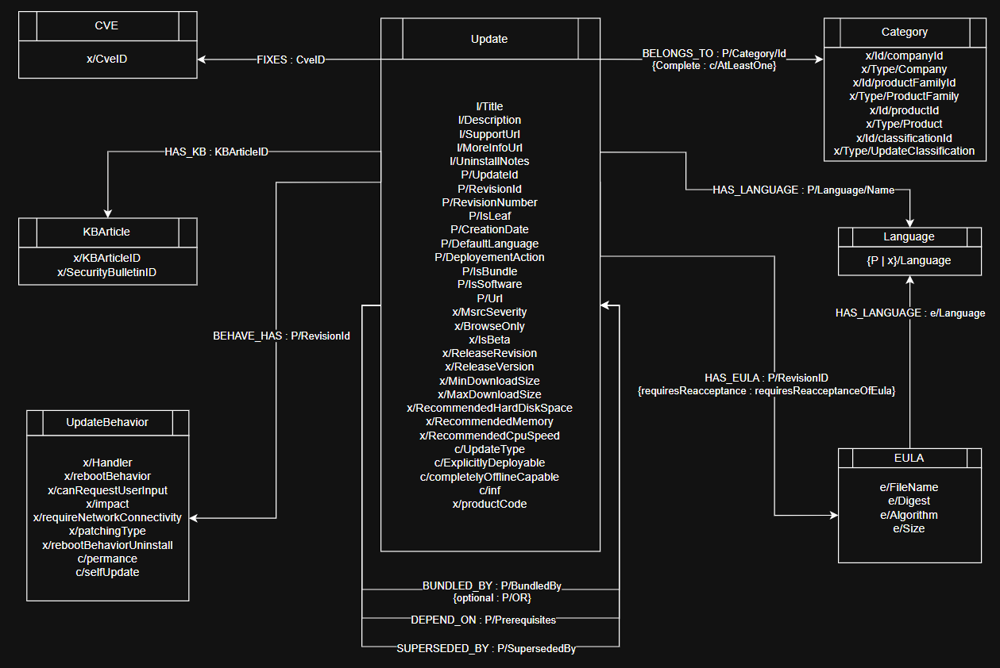

# WSUS SCN2 Knowledge Graph

[](https://www.python.org/)

A Python pipeline that converts the Microsoft WSUS offline scan catalog (`wsusscn2.cab`) into structured CSV outputs and Neo4j-ready import artifacts. It helps analyze Windows update metadata, dependency relationships, vulnerability fixes, product categories, and EULA metadata.

## Table of Contents

- [WSUS SCN2 Knowledge Graph](#wsus-scn2-knowledge-graph)
  - [Table of Contents](#table-of-contents)
  - [What this project does](#what-this-project-does)
  - [Why it is useful](#why-it-is-useful)
  - [Graph model](#graph-model)
  - [Getting started](#getting-started)
    - [Prerequisites](#prerequisites)
    - [Install dependencies](#install-dependencies)
    - [Configure the WSUS directory](#configure-the-wsus-directory)
    - [Build the revision index](#build-the-revision-index)
  - [Key workflows](#key-workflows)
    - [Export graph CSV files](#export-graph-csv-files)
    - [Import into Neo4j](#import-into-neo4j)
    - [Inspect an update by revision ID](#inspect-an-update-by-revision-id)
  - [Project structure](#project-structure)
  - [Help and support](#help-and-support)

## What this project does

This repository parses the WSUS scan catalog and extracts:

- update metadata and release attributes from `package.xml`
- extended properties from `/x/` files
- titles, descriptions, and URLs from `/l/en/` files
- package and driver metadata from `/c/` files
- EULA metadata from `/e/` files
- relationships between updates, categories, KB articles, CVEs, and languages

It produces:

- normalized CSV files for a graph model
- a flattened CSV export for spreadsheet or data analysis
- a Neo4j import pipeline via `src/main.py` that copies CSV files into Neo4j's import directory and loads constraints, nodes, and relationships

## Why it is useful

This project is useful for developers, security analysts, and researchers who need to:

- analyze Windows patch metadata at scale
- explore update dependencies and bundle relationships
- map updates to CVEs and KB articles
- build a knowledge graph from WSUS offline catalog data
- avoid re-scanning the raw archive for repeated analysis

## Graph model



The diagram shows the core graph model used for WSUS data:

- `Update` nodes represent individual Windows updates and include metadata from `package.xml`, `/x/`, `/l/en/`, and `/c/` files.
- `Category` nodes group updates by company, product family, product, and update classification.
- `KBArticle`, `CVE`, `Eula`, `Language`, and `UpdateBehavior` nodes capture related metadata and link back to updates.
- Relationship edges such as `BELONGS_TO`, `HAS_KB`, `FIXES`, `HAS_EULA`, and `HAS_LANGUAGE` express the catalog's semantic connections.
- Some relationships carry important attributes:
  - `BELONGS_TO` uses `complete` to distinguish full category assignments from partial/AtLeastOne matches
  - `DEPENDS_ON` uses `is_or` to preserve prerequisite logic
  - `HAS_EULA` uses `requires_reacceptance` to flag EULA reacceptance requirements

## Getting started

### Prerequisites

- Python 3.12.10
- `pip`
- a local extraction of `wsusscn2.cab`
- `WSUS_DIR` set to the extracted catalog root
- optionally, Neo4j for graph imports

### Install dependencies

```powershell
python -m venv .venv
.\.venv\Scripts\Activate.ps1
pip install -r requirements.txt
```

### Configure the WSUS directory

Point the pipeline to your extracted WSUS catalog folder.

**Windows (PowerShell):**

```powershell
$env:WSUS_DIR = 'C:\path\to\wsusscn2'
```

**Windows (CMD):**

```cmd
set WSUS_DIR=C:\path\to\wsusscn2
```

**Linux/macOS:**

```bash
export WSUS_DIR=/path/to/wsusscn2
```

> `wsusscn2.cab` is not included in this repository. Download it from Microsoft and extract it locally before running the scripts.
>
> The repository expects the full WSUS catalog tree to be extracted under `WSUS_DIR`, including nested CAB contents and folders such as `x`, `l`, `c`, `e`, and `package.xml`.

### Build the revision index

The parser uses `index.json` to locate WSUS files efficiently.

```bash
python src/parsing/build_index.py
```

If `category_registry.json` is needed, generate or refresh it with:

```bash
python src/etl/explore_cat_names.py
```

## Key workflows

### Export graph CSV files

Generate node and relationship CSV files for Neo4j import:

```bash
python src/etl/export_csv.py
```

### Import into Neo4j

Update `src/main.py` to match your Neo4j connection settings and import path, then run:

```bash
python src/main.py
```

### Inspect an update by revision ID

Explore a specific revision with `src/tools/inspect_update.py`, an interactive inspector that uses `index.json` to look up update metadata and localized text.

```bash
python src/tools/inspect_update.py
```

## Project structure

- `requirements.txt` — Python dependencies
- `src/parsing/parser.py` — WSUS XML parsing logic
- `src/parsing/build_index.py` — builds `index.json`
- `src/etl/export_csv.py` — exports graph CSV files
- `src/etl/export_csv_unique.py` — exports a flat CSV file
- `src/etl/explore_cat_names.py` — maps category IDs to names
- `src/tools/inspect_update.py` — interactive update inspector
- `src/main.py` — copies exported CSV files into Neo4j's import directory and loads the graph model
- `data/csv/` — output location for generated CSV files
- `docs/images/Model.png` — graph model diagram

## Help and support

For issues or questions, use the repository issue tracker and read the source-level documentation in the script headers.

- `requirements.txt` for dependency details
- `src/parsing/parser.py` for parsing behavior and model details
- `src/etl/export_csv.py` and `src/etl/export_csv_unique.py` for export workflows
- `src/main.py` for Neo4j import setup
